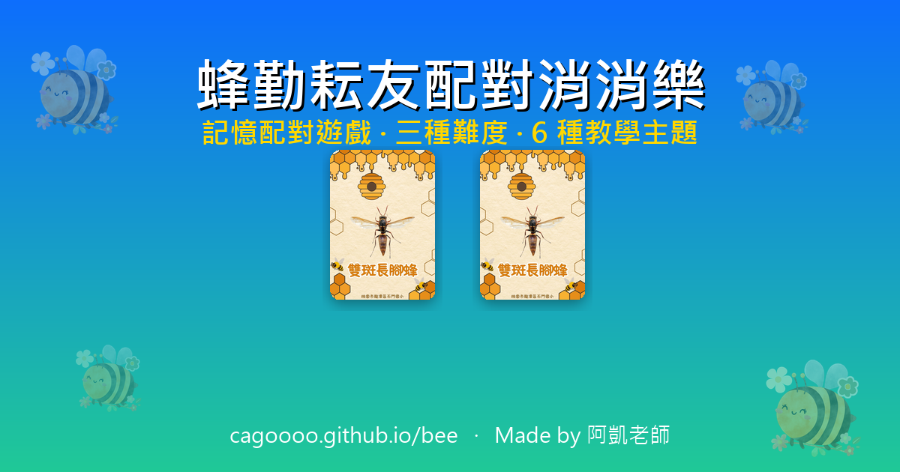

# 🐝 蜂勤耘友配對消消樂

一款結合視覺、音效與動畫的記憶配對遊戲，三種難度、6 種教學主題，支援 PWA 離線玩。

🌐 **線上版**：<https://cagoooo.github.io/bee/>



---

## ✨ 特色

- **三種難度**：初階 / 中階 / 高階，每關 5 對 = 10 張卡片
- **6 種主題包**：蜂勤耘友（圖片）、注音符號、唐詩名句、英文單字、數字英文、水果英文
- **可擴充**：所有主題定義在 `docs/themes.json`，不用寫程式即可新增主題
- **PWA**：可加到主畫面、支援離線
- **計時器 + 個人最佳紀錄**：每個主題每個難度獨立記錄
- **鍵盤無障礙**：Tab + Enter / Space 即可全鍵盤操作
- **完成慶祝**：彩帶動畫 + 個人紀錄追蹤
- **視覺優化**：WebP 圖片（省 50%）、預載強化、`<link rel="preload">`

---

## 📁 專案結構

```
bee/
├── README.md                    # 本檔
├── PROGRESS.md                  # 進度表 & 未來路線圖
├── scripts/
│   └── generate_og.py          # 產生 1200×630 OG 分享圖（Pillow）
└── docs/                        # 部署到 GitHub Pages 的資料夾
    ├── index.html               # 首頁（選擇難度 + 主題）
    ├── beginner.html / medium.html / advanced.html  # 三難度
    ├── 404.html
    ├── themes.json              # 主題包定義（這個檔案是教學工具核心）
    ├── manifest.webmanifest     # PWA 設定
    ├── sw.js                    # Service Worker
    ├── icon.png                 # PWA 應用圖示
    ├── favicon.ico
    ├── css/styles.css
    ├── js/                      # ES Modules
    │   ├── game.js              # 入口模組
    │   ├── theme.js             # 主題載入 / WebP 偵測 / 卡面渲染
    │   ├── board.js             # 棋盤建立 / 翻牌 / 配對判定
    │   ├── ui.js                # 特效 / 計時器 / 完成彈窗
    │   ├── audio.js             # 音效 / 靜音 / 背景音樂
    │   └── storage.js           # 個人最佳紀錄持久化
    ├── images/                  # WebP（主） + jpg/png fallback
    ├── audio/                   # 音效檔
    └── videos/                  # bees.mp4 首頁影片
```

---

## 🚀 本機開發

純靜態網站，不需任何後端。最簡單方式：

```bash
# 1. clone
git clone https://github.com/cagoooo/bee.git
cd bee

# 2. 啟動本機 server（Python 內建即可）
python -m http.server -d docs 8000

# 3. 瀏覽
# 開 http://localhost:8000
```

> 💡 SW + ES Modules 需要 HTTP 環境，**不能直接 file:// 開啟**。

---

## 🎨 新增教學主題

不用寫程式，只需編輯 `docs/themes.json` — 加一個新 key 到 `themes` 物件：

```json
"my-theme": {
  "name": "我的主題",
  "icon": "🎨",
  "description": "說明...",
  "cardBack": { "text": "?", "bg": "#0d6efd" },
  "levels": {
    "beginner": {
      "label": "初階",
      "pairs": [
        [{ "text": "中文", "bg": "#e63946" }, { "text": "英文", "bg": "#e63946" }],
        ...（共 5 對）
      ]
    },
    "medium": { ... },
    "advanced": { ... }
  }
}
```

支援兩種卡面類型：

| 類型 | 範例 | 用途 |
|---|---|---|
| 圖片卡 | `{ "image": "card1.webp" }` | 圖案配對（蜂勤耘友） |
| 文字卡 | `{ "text": "蘋果", "bg": "#e63946" }` | 概念配對（中英、注音、唐詩） |

然後在 `docs/index.html` 的 `<select id="theme-select">` 加一個 `<option>` 即可。

---

## 🛠 技術架構

| 區塊 | 採用 |
|---|---|
| HTML | 語意化 + ARIA + Open Graph |
| CSS | Bootstrap 5.3 (jsDelivr) + 自訂動畫 |
| JS | 原生 ES Modules，零打包工具 |
| Icon | Font Awesome 6.5 |
| 圖片 | WebP（85% size 省）+ JPG fallback |
| PWA | manifest + Service Worker（cache-first 策略） |
| 持久化 | localStorage（個人最佳紀錄） |
| 部署 | GitHub Pages from `/docs` |

---

## 🛣 路線圖

詳細的進度表 & 未來優化建議請見 [PROGRESS.md](PROGRESS.md)。

---

## 📄 授權

教育用途專案，圖片與音效資源屬「蜂勤耘友」團隊所有。

---

<div align="center">

Made with ❤️ by [阿凱老師](https://www.smes.tyc.edu.tw/modules/tadnews/page.php?ncsn=11&nsn=16#a5)

</div>
